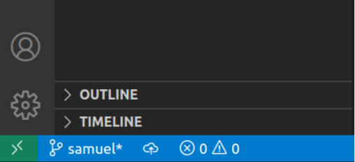

# ESMT_2024_DataScraping_Students
ESMT Students code for Data Scraping course - 2024 edition

This is the repository where each student creates their own branch and pushes (downloads) their homework after each lecture.

## Workflow: **Students** repo

Thus far there are two folders **Lectures** which is a repo for professors to share files and **< your-name >-working-folder** for working on these and other files locally. 

The last repo is **Students**. You will upload the finished exercises, milestones and projects to a personal 
branch in order for professors to see your progress and grade your work.

You should push to this repo **in your own personal branch** everytime you finished an exercise or project milestone. 

> Your personal branch should follow this format: **LASTNAME_firstname** (please use capital letters for the lastname - replace with your own names). Follow the steps below to clone the repository and create your branch.

> **If the Github branch is not correctly named using the indicated format *LASTNAME_firstname*, then penalty points will be applied.**

> Any missed deadline without justification to the Administration will result in 0 points for the homework

## Grading

| Description | Deadline | Weight in final grade |
| ---- | ---- | ---- |
| 01_Homework | October 18th 08:59 am CET | 20% |
| 02_Data_from_the_Web_lecture Self-Work exercises | October 18th 08:59 am CET | 10% |
| 03_Homework | October 21st 08:59 am CET | 15% |
| 04_Homework | October 24th 01:29 pm CET | 15% |
| Class participation | every class | 10% |
| Group Project | Presentations on October 24th | 30% |

The following steps will first help set up the repo then take you through the daily workflow used to push your work. 

##  Clone **Students** repo

First follow these steps to clone the student-code repo:

Cloning is normally **only** done once for each repo that already exists in the cloud. 

1. First click on `Clone Git Repository...`. Click on the green button **Code** and copy-paste the SSH URL. 

2. Enter the URL into the text bar at the top of VS Code. 

3. After pressing enter select your computers **desktop** as the repository destination.

4. At this point a pop up window may appear, if so enter your GitHub login and password. Once the authentication has been checked the following window should appear:

**Tip:**
As an alternative, you can simply open a Terminal windows in the directory you wish to clone the repository in, and type **git clone <SSH-URL>** where the <SSH-URL> is replaced by the URL you have copied online at step 1.

5. Once the repo has been cloned open it using `Open Folder...` under the `File` option to have an overview of the folders and files in the repo:

## Create your own branch in the student-code repo

Once the `ESMT_2024_DataScraping_Students` folder is open in 
VS Code create your own branch by following these steps:

1. Open source control on the left. Next to the words `SOURCE CONTROL` there are 3 icons and then `...` Click on  `...` 
and scroll down to `Branch` and then on to `Create Branch`

Unlike the **Lectures** repo, in **Students** you will push code to GitHub. In order to allow every student 
to be able to push their code to a personal repo, each student will create a branch. 

2. Give the branch this name: **LASTNAME_firstname** so your instructor can recognize who is who. **If the Github branch is not correctly named using the indicated format *LASTNAME_firstname*, then penalty points will be applied.**

3. Once the branch has been created, publish the branch to github by clicking on the **Publish branch**. This will ensure 
that there is access to the repo online as well as locally. 

As you can see in the bottom left corner of VS Code the **Current branch** name should no longer be main but 
the name you gave it (in the example `samuel`). In **Students** you should **ONLY** work on the branch you created. 

You can also visit the `Students` github in your browser to see the branch online.

### Adding files to **Students** repo

Adding work to your branch should be part of your daily routine during the course. 

Once you have finished working on some code in your **working-folder**, copy the file(s) to the **Students** repo. 

Git will recognize the changes in the repository and list it in the source control window. 
In the example one `README.md` file was added to the repo. 

1. Click on the file you would like to stage and additionally click on the `+` symbol to stage the change. 

2. Once the file(s) has been staged then commit the change(s). Before committing add a message to give some insight 
into the changes that are being committed. 

3. Once the change(s) have been committed then push (sync) the data online by clicking on `sync changes`. 

4. You then be asked to confirm that you want to complete the sync. Feel free to push `OK, Don't Show Again` or only 
`OK` until you are comfortable with the workflow

After these steps the local and online repos should be synced and your instructors now have access to your code and 
look over it to review. 

**Please push your work on a daily basis throughout the course. 
You code will be checked to ensure you are meeting graduation requirements.**

If everything has been set up correctly you should have the folder structure below on your computer:
* ESMT_2024_DataScraping_Lectures
* ESMT_2024_DataScraping_Students
* working-folder